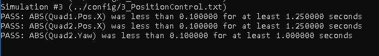

# Project building a controller #

## Each CRITERIA ##

### 1. Implemented body rate control in C++. ###

I implemented function `BodyRateControl` in line (96 - 127) of `QuadControl.cpp`.

From pqr cmd and current pqr I computed error of pqr, and used it to calculate angular acceleration (multipled by kpPQR). Then i computed Moment cmd (angular acceleration multipled by I *Moment of Inertial*).

### 2. Implement roll pitch control in C++. ###

I implemented function `RollPitchControl` in line (130 - 168) of `QuadControl.cpp`.

I calculate Rotation matrix from attitude. And then i used two equation below to compute Pc and Qc:

`equation 1`

`equation 2`

But i can't understand where we have equation 2. When i remove R33 of equation 2, i had better result.

### 3. Implement altitude controller in C++. ###

Function `AltitudeControl` in line 170 - 206 of `QuadControl.cpp`.
1. I computed the Force in world-frame from error Z, erro Z dot, integratedAltitudeError, accelZCmd.
2. I add GRAVITY on it.
3. I divide it by R(2,2) of Rotation-Matrix to convert into body-frame. It's thrustcmd what we need.

### 4. Implement lateral position control in C++. ###

Function `LateralPositionControl` in line 209 - 256 of `QuadControl.cpp`.
I computed accel-cmd from error (x,y), erro (x,y) dot, accelCmdFF (it's same altitude control).

### 5. Implement yaw control in C++. ###

Function `YawControl` in line 259 - 292 of `QuadControl.cpp`.
I computed YawRateCmd only from error of yaw (YawCmd - Yaw).

### 6. Implement calculating the motor commands given commanded thrust and moments in C++. ###

Function `GenerateMotorCommands` in line 56 - 94 of `QuadControl.cpp`.
Function `BodyRateControl` in line 96 - 127 of `QuadControl.cpp`.

1. From Pc, Qc, Rc, i computed p_dot_cmd, q_dot_cmd, r_dot_cmd. (BodyRateControl function)
2. Use equation below to calculate c_bar,p_bar,q_bar,r_bar. And then computed omegas. (GenerateMotorCommands function)

 
 
## Test scenarios. ##
 
`scenario2`
 

`scenario03`
 

 
`scenario04`

 
`scenario05`

